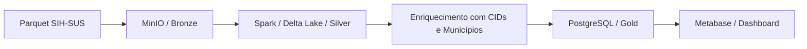

# 🏥 Informações Hospitalares – Análise com Spark, Delta Lake e Metabase

Este projeto tem como objetivo explorar e analisar dados públicos de internações hospitalares no Brasil (SIH-SUS), aplicando conceitos de engenharia de dados com foco em **Spark**, **Delta Lake**, **MinIO**, **PostgreSQL** e **Metabase**.

---

## 🚀 Objetivo

Construir um pipeline completo para ingestão, transformação e visualização dos dados de saúde, com foco em:

- Praticar conceitos de arquitetura moderna de dados (Data Lakehouse)
- Analisar os principais motivos de internação no estado de São Paulo (2024)
- Consolidar aprendizados do MBA em Engenharia de Dados
- Criar um repositório público e replicável para portfólio técnico

---

## 🧱 Arquitetura

O ambiente foi construído via **Docker Compose**, contendo os seguintes serviços:

- **Apache Spark** – Processamento distribuído e transformações
- **Delta Lake** – Armazenamento transacional na camada Silver
- **MinIO** – Data Lake compatível com S3
- **PostgreSQL** – Camada Gold para consumo e visualização
- **Metabase** – Dashboard analítico
- **Apache NiFi** – Planejado para futura ingestão automatizada
- **Kafka + Zookeeper** – Provisionado para testes futuros com streaming



---

## 📁 Estrutura do Projeto

```
Informacoes_hospitalares/
├── notebooks/              # Scripts PySpark (.ipynb)
├── docker-compose.yml      # Infraestrutura local
├── metabase_data/          # Persistência opcional do Metabase
├── data/                   # Arquivos auxiliares (ex: CSV de CID-10)
├── docs/                   # Print do dashboard
└── README.md               # Este arquivo
```

---

## ▶️ Como Executar Localmente

> Pré-requisitos:
> - Docker e Docker Compose
> - Git
> - PySpark (caso rode localmente fora do container)

1. Clone o repositório:

```bash
git clone https://github.com/seu-usuario/Informacoes_hospitalares.git
cd Informacoes_hospitalares
```

2. Suba o ambiente:

```bash
docker compose up -d
```

3. Acesse os serviços:

- **MinIO**: http://localhost:9001  
  Login: `admin` | Senha: `SenhaForte123!`

- **Metabase**: http://localhost:3000  
  Login: definido na primeira configuração

- **PostgreSQL**: `localhost:5432`  
  Usuário: `admin` | Senha: `SenhaForte123!` | Banco: `my_database`

4. Execute os notebooks da pasta `notebooks/` para:

- Carregar os dados Parquet no MinIO
- Processar com Spark e gravar no Delta Lake (Silver)
- Enriquecer com descrição dos CIDs e municípios
- Gravar os dados tratados no PostgreSQL (Gold)

---

## 📊 Dashboard

O dashboard foi criado no Metabase, explorando os principais motivos de internação no estado de SP.

> 📷 Um print do dashboard será incluído na pasta `/docs`.

---

## 🧠 Tecnologias e Ferramentas

- Apache Spark 3.5.8  
- Delta Lake  
- MinIO  
- PostgreSQL  
- Metabase  
- Docker / Docker Compose  
- Python (PySpark, pandas)  
- Dados Públicos SUS (FI/SIH)

---

## 👤 Autor

**Marcos Freitas Alves**  
[LinkedIn](https://www.linkedin.com/in/marcos-freitas-alves)

---

## 📄 Licença

Este projeto está licenciado sob os termos da licença MIT.